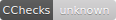
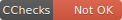
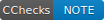
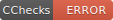

CRAN Check Results API
======================

The was originally just rOpenSci packages, but is now all packages on CRAN.

Base URL: <https://cranchecks.info/>

[API Docs](docs/api_docs.md)

No authentication needed

Check out [cchecks][] for an R package interface to this API

tech:

* language: Ruby
* rest framework: Sinatra
* scraping http requests: faraday
* databases: mongodb, mariadb
* server: caddy
* container: all wrapped up in docker (docker-compose)
* uses Gábor's <https://crandb.r-pkg.org> API to get names of CRAN packages
* A cron job:
    * scrapes pkg specific data __every 3rd hour__ 
    * scrapes maintainer level data __every 4th hour__
    * poplulates the history routes once a day
* for the history routes, we keep the last 30 days of checks for each package; each day we purge any checks data older than 30 days

## JSON API examples

To replicate the examples below as is, you'll need curl (which you likely have), and jq (<https://stedolan.github.io/jq/>) which you may not have. You can also just copy/paste the URLs into your browser 😏

All pkgs from a maintainer that have any checks not passing

```sh
curl https://cranchecks.info/maintainers/csardi.gabor_at_gmail.com | jq '.data.table[] | select(.any) | .package'
```

Similar but across all packages

```sh
curl https://cranchecks.info/pkgs?limit=10 | jq '.data[] | select(.summary.any) | .package'
```

Packages that have error status checks

```sh
curl https://cranchecks.info/pkgs?limit=1000 | jq '.data[] | select(.summary.error > 0) | .package'
```

### workflow for checking your own packages

Check if you have any packages have one or more of a current status across operating systems and R versions, e.g., errors

```sh
curl https://cranchecks.info/maintainers/csardi.gabor_at_gmail.com  | jq '.data.table[] | select(.error > 0)'
```

```sh
{
  "package": "rcmdcheck",
  "any": true,
  "ok": 9,
  "note": 0,
  "warn": 0,
  "error": 3
}
{
  "package": "secret",
  "any": true,
  "ok": 11,
  "note": 0,
  "warn": 0,
  "error": 1
}
```

Then grab the check details for a specific package

```sh
curl https://cranchecks.info/pkgs/secret  | jq .data.check_details
```

```sh
{
  "version": "1.0.0",
  "check": "examples",
  "result": "ERROR",
  "output": "Running examples in 'secret-Ex.R' ... cutoff",
  "flavors": [
    "r-devel-windows-ix86+x86_64"
  ],
  "additional_issues": []
}
```

Optionally see the check details for previous CRAN checks in the `/history` route (up to 30 days prior to the current date) (though as of this writing we have only about 10 days)

```sh
curl https://cranchecks.info/pkgs/secret/history | jq '.data.history[].check_details'
```

```sh
{
  "version": "1.0.0",
  "check": "examples",
  "result": "ERROR",
  "output": "Running examples in 'secret-Ex.R' ... cutoff",
  "flavors": [
    "r-devel-windows-ix86+x86_64"
  ],
  "additional_issues": []
}
{
  "version": "1.0.0",
  "check": "examples",
  "result": "ERROR",
  "output": "Running examples in 'secret-Ex.R' ... cutoff",
  "flavors": [
    "r-devel-windows-ix86+x86_64"
  ],
  "additional_issues": []
}
... cutoff
```


## Badges

> also check out badges from R-hub for CRAN versions, CRAN release dates, and CRAN downloads <https://docs.r-hub.io/#badges>

markdown egs to use in your README

linking to cran checks page (likely want to use `cran.r-project.org` url since cran check will complain about a different mirror's base url)

[](https://cran.r-project.org/web/checks/check_results_reshape.html) -> `[](https://cran.r-project.org/web/checks/check_results_reshape.html)`

Or maybe link to JSON response for this API

[](https://cranchecks.info/pkgs/reshape) -> `[](https://cranchecks.info/pkgs/reshape)`

pkgs using the badges:

- [rgbif](https://github.com/ropensci/rgbif#rgbif)
- [wellknown](https://github.com/ropensci/wellknown#wellknown)
- [taxize](https://github.com/ropensci/taxize#taxize)

### package status summaries

- `/badges/summary/:package` all okay?, no notes, warnings, or errors
    - if any notes, warnings, or errors = `Not OK` (color:red)
    - if NO notes, warnings, or errors = `OK` (color:green)
- `/badges/worst/:package` worst result:
    - if any errors = `ERROR` (color:red)
    - if any warnings, and no errors = `WARN` (color:yellow)
    - if any notes, and no errors or warnings = `NOTE` (color:blue)
    - if no errors, warnings, or notes = `OK` (color:green)

__NOT SUPPORTED YET__

- `/badges/noerrors/:package` no errors? but could have warnings or notes 
- `/badges/nowarns/:package` no warns? no errors, no warnings, but could have notes
- `/badges/nonotes/:package` no notes? no errors, no warnings, and no notes

### per flavor

- `/badges/flavor/:flavor/:package` flavor + package, where flavors are any one of:

    operating systems 

        - linux
        - windows
        - osx
        - solaris

    R versions

        - devel
        - oldrel
        - patched
        - release

With meanings:

- if any notes, warnings, or errors = `Not OK` (color:red)
- if NO notes, warnings, or errors = `OK` (color:green)

### Query parameters

- `ignore`: if `true`, ignore any `NOTE`'s and get a green `OK` badge. supported by `/badges/summary` and `/badges/flavor`

### examples

both badges routes



package summary route




flavor route





[cchecks]: https://github.com/ropenscilabs/cchecks


